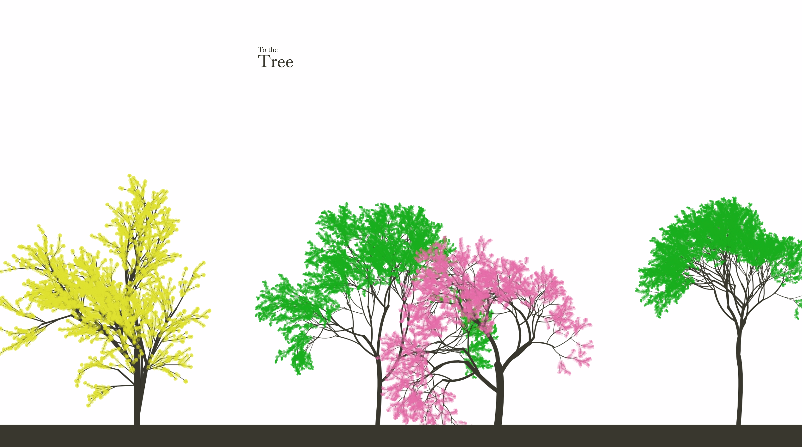
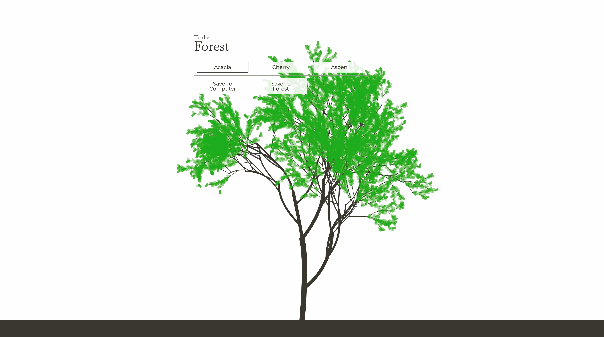

# Forest
### [Live Demo](https://forest-d0bd9.firebaseapp.com/ "Live link of Forest")


## Summary:
An elegant, serverless pet-project that demonstrates the mathematical nature of plants, and art. 

## Key Features:

### Custom Recursive Tree Algorithm

The base of the tree function is recursive, with helper mathematical functions. I utilized trigonometry, and bezier curves to calculate points. 26 adjustable parameters were used to define each tree model. The tree functions were organized into classes, and helper files. 
``` javascript
export const tree1 = {
  startPt: { x: 600, y: 1200 },
  levels: 6,
  currLev: 0,
  layerLenRatio: 75,
  layerWidthRatio: 60,
  // branch params
  branchColor: blackBrown,
  branchDensity: 3,
  branchThickness: 15,
  branchLength: 230,
  branchBendyness: 10,
  branchBendPlacement: 90,
  // leaf params
  leafColor: leafGreen,
  leafDensity: 5,
  leafWidth: 6,
  leafLength: 6,
  leafNum: 1,
  leafSpread: 90,
  leafStartRatio: 0,
  leafEndRatio: 100,
  leafAngleChange: 45,
  // angle params
  angle: 90,
  angleChange: 15,
  angleRange: 45,
  anglePattern: 'alternating',
  // point params
  ptStartRatio: 40,
  ptEndRatio: 100,
  ptDistribution: 'random'
};
```

### Utilization of SVG.js 

In order to easily generate, manipulate, and attach SVGs to the DOM I chose to use the SVG.js library. 

### Image saving, and file conversion

Scalable vector graphics was chosen as file format, because it is highly reusable as an image asset. This means that when users save their trees to their devices, they can easily use them for a menagerie of applications. Due to the complexity of the trees, the SVG files are very large in file size, so I used an NPM package to convert the files to a PNG format, to both reduce the file size, and retain the transparency information. 

### Google Firebase hosting, and image storage

The minimalist nature of the project meant that I didn’t need a server since I only needed to save images. I chose to use Firebase, since it offers hosting, and cloud bucket storage. After the tree is converted into a PNG image, it is uploaded to the bucket. The newest images are then fetched, and attached to the DOM to populate the forest.
``` javascript
// SAVE TREE TO FIREBASE BUCKET
async function saveToBucket(data) {
  const date = new Date();
  const storage = firebase.storage();
  const storageRef = storage.ref();
  const treeSvgRef = storageRef.child(`tree_${ date.getTime() }.png`);

  const pngFile = await svg2png({
    input: data,
    encoding: 'buffer',
    format: 'png',
    width: 1200,
    height: 1200,
    multiplier: 1,
    quality: 1
  });

  await treeSvgRef.put(pngFile);
  console.log('Successfully saved to bucket');
}
```

### Simple, elegant UI/UX

The concept was for all the focus to be on the generated assets, so a minimalist, non-distracting background was chosen. On a previous iteration of the project there were slider bars that allowed users to manipulate tree parameters, but due to the non-linear scaling of many of the parameters, the app was easy to break. Therefore, I created preset trees, chose the magic number 3, and updated the UI. I believe this resulted in a more elegant overall look, while still allowing users to feel that their tree is unique. 
